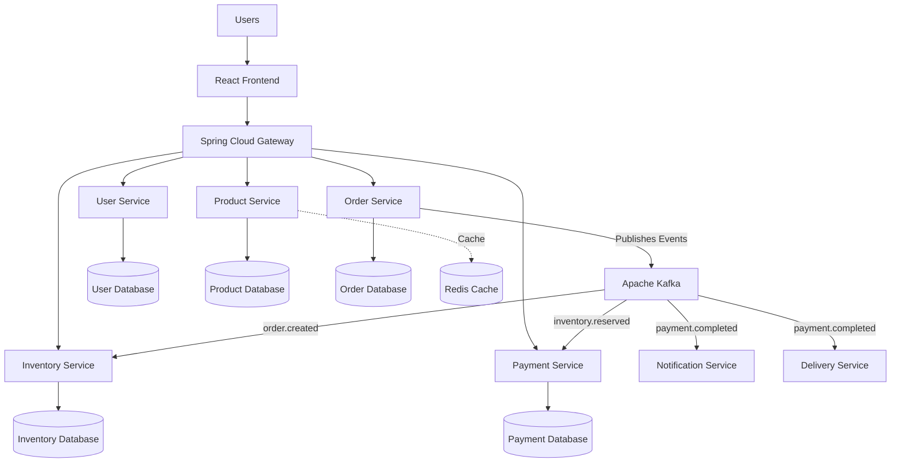

# Scalable Event-Driven E-Commerce Platform

<p align="center">

A production-grade distributed system built with <strong>Spring Boot Microservices</strong>, <strong>Apache Kafka</strong>, <strong>PostgreSQL</strong>, <strong>Redis</strong>, <strong>Docker</strong>, and <strong>React</strong>.

The project demonstrates modern backend engineering principles including event-driven communication, service decomposition, database-per-service architecture, and scalable system design.

</p>

<p align="center">


</p>

---

# System Architecture

The platform follows an event-driven microservices architecture. Client requests are routed through a centralized API Gateway, while business services communicate asynchronously using Apache Kafka. Each microservice owns its own database, ensuring loose coupling and independent scalability.




---

# Overview

Modern e-commerce platforms require more than CRUD operations. They must support independent deployments, scalable communication, fault isolation, and clear separation of business responsibilities.

This repository explores those engineering challenges through a distributed microservices architecture where every service owns its own business capability and communicates asynchronously using Apache Kafka events.

Rather than focusing on a single framework, the project emphasizes architectural thinking, maintainability, and production-oriented backend development.

---

# Why Event-Driven Architecture?

Traditional synchronous communication creates tight dependencies between services, making systems harder to scale and maintain.

This project adopts an event-driven architecture to allow services to communicate through business events instead of direct service-to-service calls whenever possible.

This approach provides:

- Loose coupling
- Independent deployments
- Better fault isolation
- Improved scalability
- Asynchronous processing
- Easier feature evolution

---

# Key Characteristics

- Spring Boot Microservices
- Apache Kafka Event Streaming
- Database-per-Service Architecture
- API Gateway
- JWT Authentication
- PostgreSQL
- Redis Caching
- Dockerized Infrastructure
- RESTful APIs
- Layered Architecture
- Maven Multi-Module Project

---

# Technology Choices

The technologies used in this project were selected based on architectural requirements rather than popularity. Each component serves a specific purpose within the overall system.

| Technology | Why it was chosen |
|------------|-------------------|
| Java 17 | Modern LTS release with improved language features and long-term support |
| Spring Boot | Rapid development of production-ready microservices |
| Spring Cloud Gateway | Centralized routing, filtering, and request forwarding |
| Apache Kafka | Asynchronous communication and loose coupling between services |
| PostgreSQL | ACID-compliant relational database for reliable business data |
| Redis | High-speed caching to reduce database load and improve response time |
| Docker | Consistent development and deployment environments |
| Maven | Dependency management and multi-module project structure |
| React | Component-based frontend architecture for a modern user experience |

---

# Service Responsibilities

Each service has a single business responsibility and owns its own data, allowing independent development, deployment, and scaling.

| Service | Responsibility |
|----------|----------------|
| API Gateway | Entry point for all client requests, routing, and cross-cutting concerns |
| User Service | User registration, authentication, authorization, and profile management |
| Product Service | Product catalog, categories, pricing, and search |
| Order Service | Order creation, validation, and lifecycle management |
| Inventory Service | Stock reservation, availability checks, and inventory updates |
| Payment Service | Payment processing, transaction handling, and payment status |
| Notification Service | Email and in-app notifications triggered by business events |
| Delivery Service | Shipment assignment, delivery status, and order tracking |


---


# Advanced Distributed Systems Capabilities

Beyond standard CRUD operations, this platform is designed to demonstrate engineering patterns commonly used in large-scale e-commerce and fintech systems.

| Capability                         | Design Approach                                                                                                                                                                                                       | Engineering Benefit                                                                                              |
| ---------------------------------- | --------------------------------------------------------------------------------------------------------------------------------------------------------------------------------------------------------------------- | ---------------------------------------------------------------------------------------------------------------- |
| **Saga Pattern with Compensation** | Distributed transactions are coordinated by the Order Service. If any downstream operation fails (such as inventory reservation or payment), compensating actions automatically roll back previously completed steps. | Maintains data consistency across multiple independent services without using distributed database transactions. |
| **Idempotent Payment Processing**  | Every payment request is associated with a unique **Idempotency Key**. Duplicate requests are safely ignored to ensure that the same payment is never processed twice.                                                | Protects against duplicate charges caused by retries, network failures, or client-side resubmissions.            |
| **Inventory Reservation System**   | Product inventory is temporarily reserved when an order is placed. If payment is not completed within a configurable timeout period (for example, 10 minutes), the reservation is automatically released.             | Prevents overselling while allowing customers a reasonable checkout window.                                      |
| **Real-time Delivery Tracking**    | The Delivery Service publishes live location updates through WebSocket connections, allowing the frontend to receive delivery status changes without polling.                                                         | Provides a responsive user experience and demonstrates real-time event streaming.                                |

These capabilities reflect the architectural goals of the platform and represent production-inspired solutions for handling distributed transactions, concurrency, reliability, and real-time communication.


---


# Architecture Decisions

Several architectural decisions were made to improve scalability, maintainability, and long-term flexibility.

| Decision | Benefit |
|----------|---------|
| Microservices Architecture | Independent deployment and scaling of business domains |
| Event-Driven Communication | Loose coupling and asynchronous processing |
| Database per Service | Data ownership and service autonomy |
| API Gateway | Single entry point for clients and centralized request handling |
| Layered Architecture | Better separation of responsibilities and easier testing |
| RESTful APIs | Standardized communication between clients and services |
| Dockerized Development | Consistent environments across all machines |

---

# High-Level Event Flow

The following workflow illustrates how a typical order moves through the platform.

```text
Customer

    │

    ▼

API Gateway

    │

    ▼

Order Service

    │
    │  Publish Event
    ▼

Apache Kafka

    │
    ├────────────► Inventory Service
    │
    ├────────────► Payment Service
    │
    ├────────────► Notification Service
    │
    └────────────► Delivery Service

```

Each service reacts independently to business events without requiring direct communication with other services.

---

# Repository Layout

```text
event-driven-ecommerce-platform/

├── backend/
│   ├── api-gateway/
│   ├── user-service/
│   ├── product-service/
│   ├── order-service/
│   ├── inventory-service/
│   ├── payment-service/
│   ├── notification-service/
│   └── delivery-service/
│
├── frontend/
│
├── docs/
│   ├── architecture.png
│   ├── sequence-diagram.png
│   └── database-design.png
│
├── docker/
│
├── scripts/
│
├── .github/
│
├── docker-compose.yml
├── pom.xml
└── README.md
```

The repository is organized to keep application code, infrastructure, documentation, and automation clearly separated. This structure makes navigation easier and supports independent development of each service.

---

# Engineering Principles

The project is developed with an emphasis on writing maintainable and production-oriented code.

Core principles include:

- Separation of Concerns
- SOLID Principles
- Clean Architecture
- Layered Design
- Dependency Injection
- Constructor Injection
- RESTful API Design
- Stateless Services
- Reusable Components
- Consistent Package Structure
- Meaningful Git Commit History
- Configuration Externalization

---

# Running the Project Locally

## Prerequisites

Install the following software before running the project.

| Software | Recommended Version |
|----------|---------------------|
| Java | 17+ |
| Maven | 3.9+ |
| Node.js | 20+ |
| Docker Desktop | Latest |
| PostgreSQL | 16+ |
| Git | Latest |

---

## Clone the Repository

```bash
git clone https://github.com/devangthummar/event-driven-ecommerce-platform.git

cd event-driven-ecommerce-platform
```

---

## Start Infrastructure

Run the required infrastructure services.

```bash
docker compose up -d
```

This starts services such as PostgreSQL, Redis, Apache Kafka, Zookeeper, Kafka UI, and other supporting containers defined in the Docker Compose configuration.

---

## Run a Backend Service

Example:

```bash
cd backend/product-service

mvn clean install

mvn spring-boot:run
```

Repeat the same process for any other microservice.

---

## Run the Frontend

```bash
cd frontend

npm install

npm run dev
```

---

# Design Principles

The project follows several engineering principles to keep the codebase maintainable and scalable.

- Single Responsibility Principle
- Separation of Concerns
- Dependency Injection
- Layered Architecture
- Stateless Service Design
- Database Ownership
- Event-Driven Communication
- Interface-Based Programming
- Constructor Injection
- Clean Package Organization

---

# Engineering Trade-offs

Every architectural decision introduces trade-offs. The following choices were made intentionally based on the project's goals.

| Decision | Benefit | Trade-off |
|----------|---------|-----------|
| Microservices | Independent deployment and scaling | Increased operational complexity |
| Apache Kafka | Loose coupling and asynchronous communication | Additional infrastructure to manage |
| PostgreSQL | Strong consistency and transactional reliability | Vertical scaling is more challenging than some NoSQL solutions |
| Redis | Low-latency caching and reduced database load | Cache synchronization must be managed |
| API Gateway | Centralized routing and request handling | Additional network hop |
| Docker | Consistent environments across development and deployment | Requires container orchestration knowledge |

---

# Future Architecture

The current architecture has been designed so that additional enterprise capabilities can be integrated without significant structural changes.

Possible future extensions include:

- Kubernetes Deployment
- Elasticsearch
- Distributed Tracing
- Centralized Logging
- OAuth2 / OpenID Connect
- API Rate Limiting
- CI/CD Pipeline
- Prometheus & Grafana Monitoring
- OpenAPI Documentation
- Service Discovery

---

# Learning Outcomes

Building this project demonstrates practical experience with:

- Designing distributed systems
- Building Spring Boot microservices
- Implementing event-driven communication
- REST API development
- Database design
- Docker-based development
- Backend architecture
- Software engineering best practices
- Git and GitHub workflow
- Modular application development

---

# License

This project is licensed under the MIT License.

See the `LICENSE` file for additional information.

---

# Author

**Devang Thummar**

Backend Developer focused on building scalable Java applications and modern distributed systems.

**GitHub**

https://github.com/devangthummar

**LinkedIn**

https://www.linkedin.com/in/devang-thummar-a98796397

---

<p align="center">

Designed and developed with a focus on clean architecture, scalable backend systems, and modern software engineering practices.

</p>
