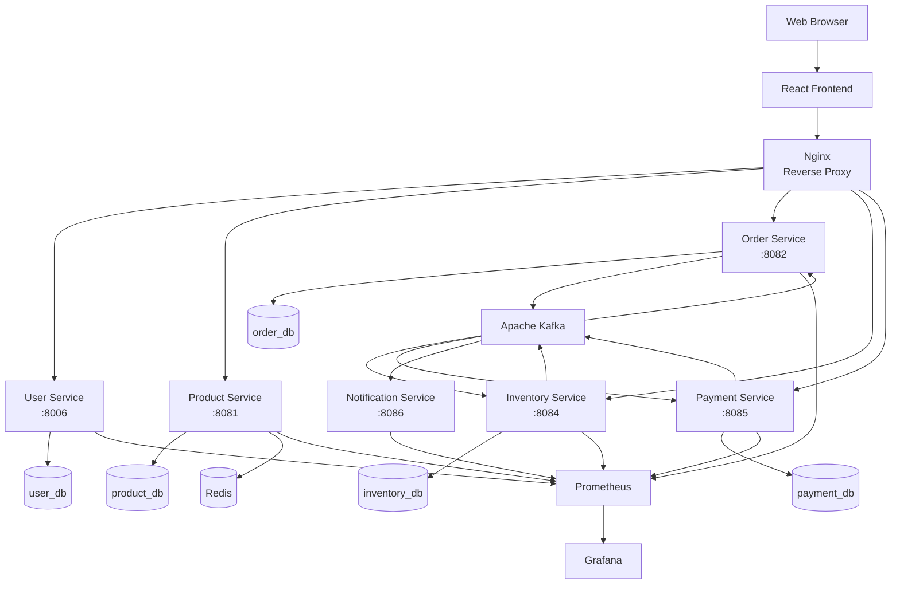
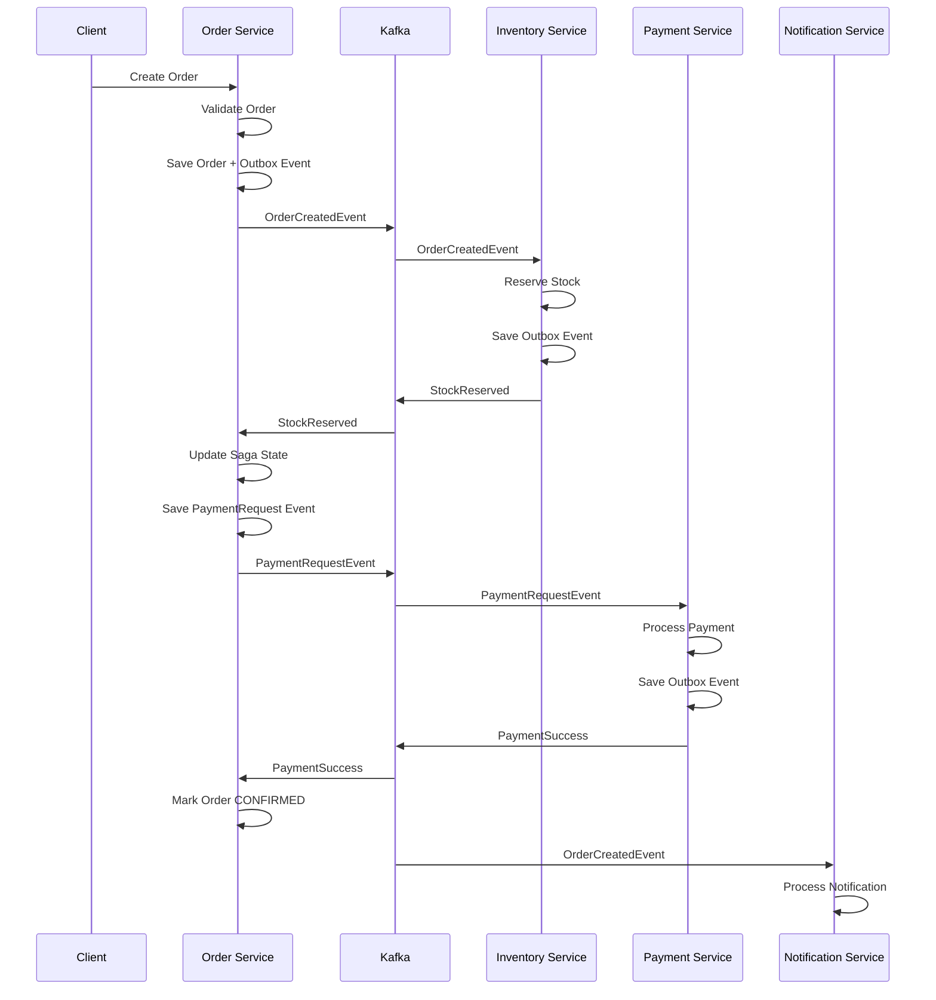
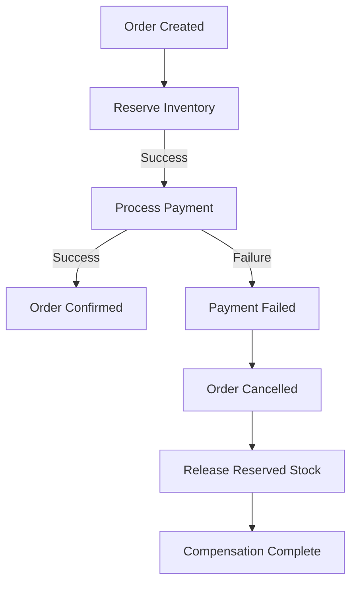
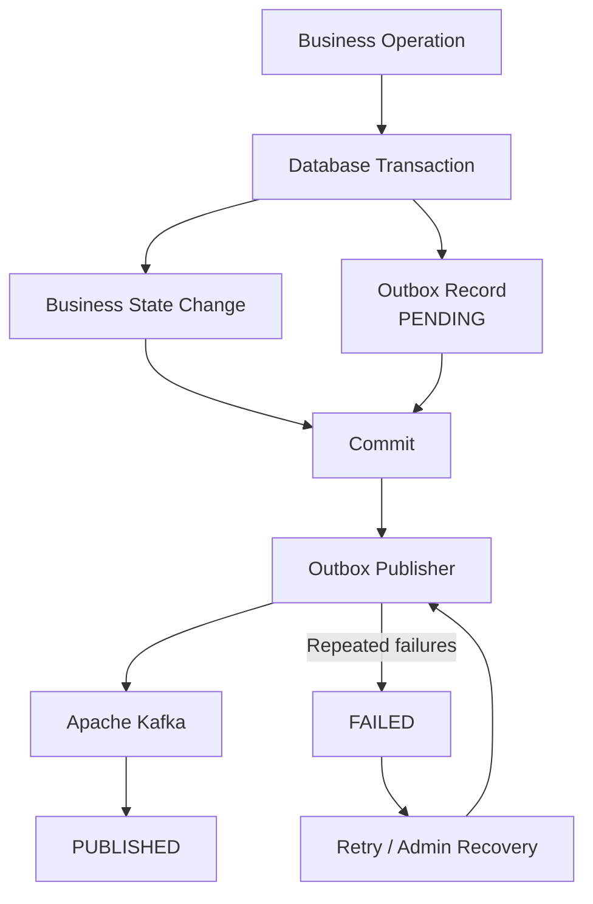
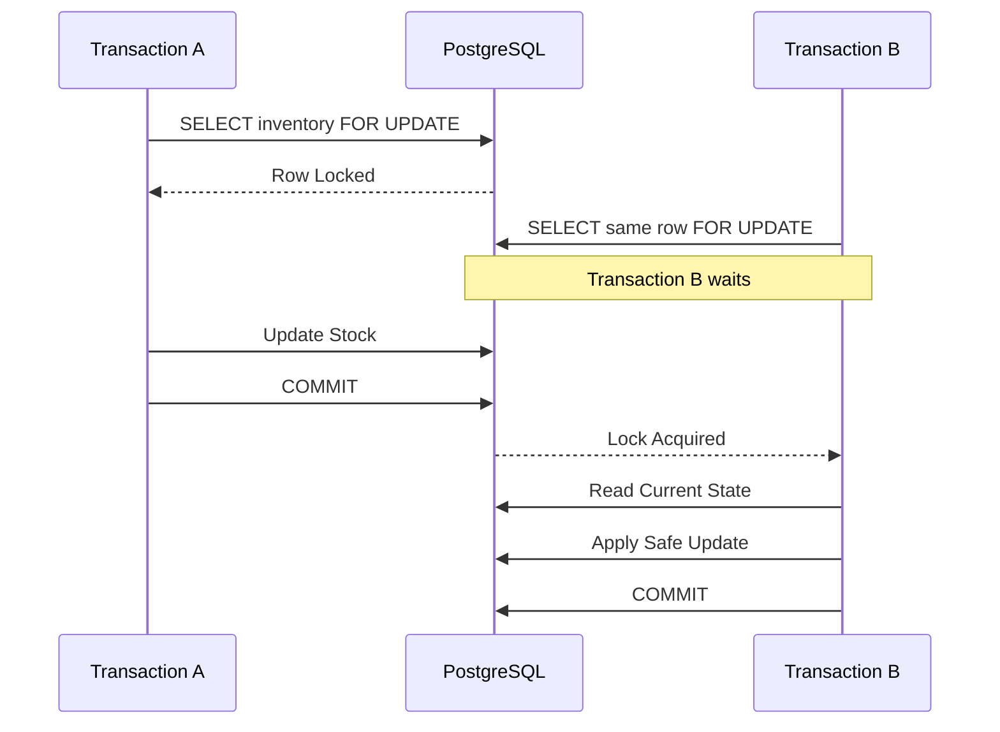
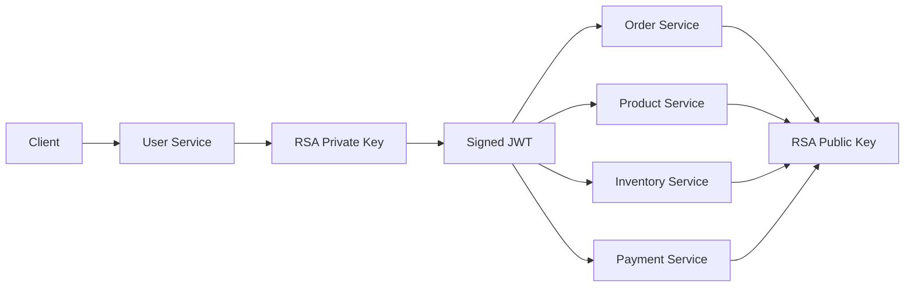
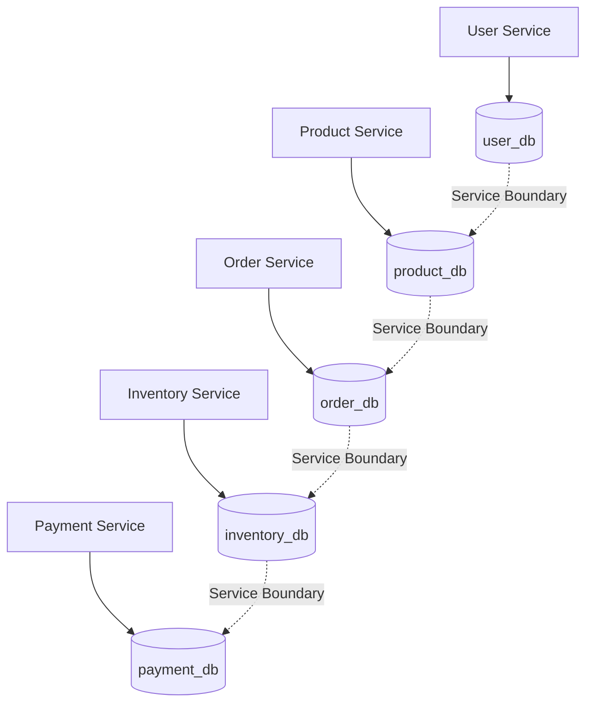
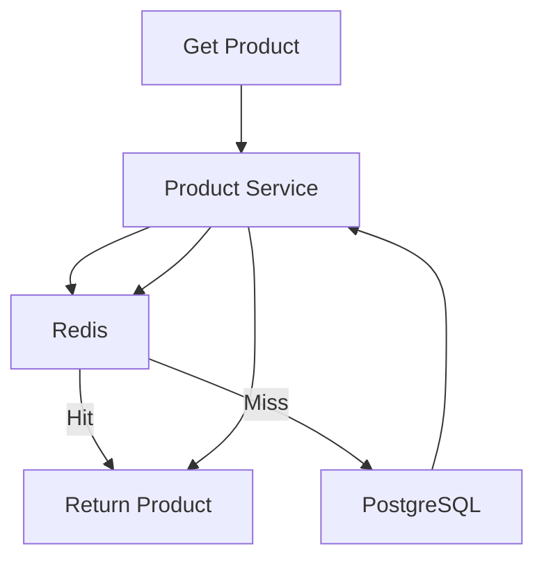
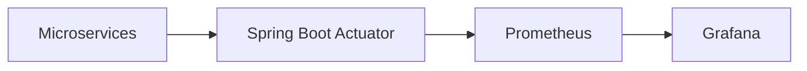
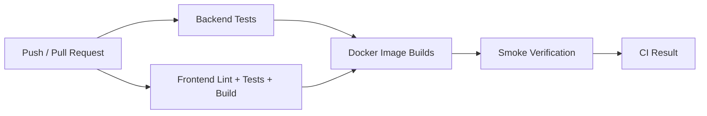

# Distributed Order Orchestration & Transaction Platform

A production-oriented full-stack e-commerce platform built with **Java, Spring Boot, Apache Kafka, PostgreSQL, Redis, React, Docker, and GitHub Actions**.

The project focuses on distributed-system engineering, including **Saga orchestration, transactional outbox, idempotency, database concurrency control, JWT RS256 security, caching, observability, automated testing, and CI/CD**.

---

## Architecture

The platform is composed of six independently deployable backend services. Each service owns its data, while Kafka coordinates asynchronous business workflows.



### Architecture principles

* Database-per-service
* Event-driven communication
* Saga orchestration
* Transactional Outbox
* Idempotent operations
* Pessimistic and optimistic locking
* Stateless JWT authentication
* Redis cache-aside
* Containerized infrastructure
* Automated testing
* CI/CD
* Metrics and health monitoring

---

## Services

| Service              |   Port | Responsibility                                                 |
| -------------------- | -----: | -------------------------------------------------------------- |
| User Service         | `8006` | Registration, authentication, user management and JWT issuance |
| Product Service      | `8081` | Product catalog and product management                         |
| Order Service        | `8082` | Order lifecycle and Saga orchestration                         |
| Inventory Service    | `8084` | Stock management and reservation                               |
| Payment Service      | `8085` | Payments, wallet operations and idempotency                    |
| Notification Service | `8086` | Kafka-based notification processing                            |

### Infrastructure

| Component      | Purpose                          |
| -------------- | -------------------------------- |
| PostgreSQL     | Persistent service-owned data    |
| Apache Kafka   | Asynchronous event communication |
| Redis          | Product caching                  |
| Nginx          | Reverse proxy and rate limiting  |
| Prometheus     | Metrics collection               |
| Grafana        | Metrics visualization            |
| Docker Compose | Container orchestration          |

---

# Distributed Order Workflow

The Order Service coordinates the order Saga.



The system uses asynchronous events for the distributed workflow while retaining synchronous HTTP communication where an immediate response is required.

For example, Order Service synchronously retrieves product pricing from Product Service during order creation.

---

# Saga Compensation

A distributed transaction cannot rely on a single database transaction because each service owns independent data.

The platform therefore uses compensating actions.



Example failure path:

```text
Order Created
      |
      v
Inventory Reserved
      |
      v
Payment Failed
      |
      v
Order Cancelled
      |
      v
Reserved Inventory Released
```

This provides distributed consistency without requiring a distributed database transaction.

---

# Transactional Outbox

The project uses the **Transactional Outbox Pattern** to reliably persist business events before asynchronous publication.

The business state change and outbox record are committed within the same local database transaction.



### Outbox lifecycle

```text
PENDING
   |
   v
Publisher
   |
   +-----------> Kafka -----------> PUBLISHED
   |
   +-----------> Retry
                   |
                   v
                 FAILED
                   |
                   v
              Admin Recovery
```

The implementation supports:

* Persistent event records
* Batch publishing
* Retry handling
* Failed-event state
* Administrative recovery
* Partition keys
* Event payload persistence

The delivery model is **at-least-once**. Duplicate delivery is therefore possible, and consumers must handle relevant events idempotently.

The system does not claim exactly-once delivery between PostgreSQL and Kafka.

---

# Reliability and Idempotency

The platform protects important business operations against duplicate requests and concurrent execution.

### Order idempotency

Orders use a unique combination of:

```text
(user_id, idempotency_key)
```

Repeated requests using the same key do not create duplicate orders.

### Payment idempotency

Payment records enforce unique order relationships so the same order cannot be processed multiple times.

### Inventory protection

Inventory reservation prevents duplicate reservation of the same order/product combination.

### Atomic wallet operations

Wallet balance updates use guarded atomic database operations to prevent concurrent requests from spending the same balance.

---

# Concurrency Control

Inventory and payment operations contain critical sections where concurrent requests could otherwise produce inconsistent state.

The project uses:

* PostgreSQL pessimistic locking
* `SELECT FOR UPDATE`
* JPA `@Version`
* Database unique constraints
* Atomic SQL updates
* Transaction boundaries
* Concurrency integration tests



This is particularly important for inventory reservation and stock modification.

---

# Security

Authentication uses **JWT with RS256 asymmetric signing**.

The User Service owns the RSA private key and signs tokens.

Other services validate tokens using the public key.



### JWT claims

```text
sub
iss
exp
role
userId
```

### Authorization model

| Role    | Access                                                    |
| ------- | --------------------------------------------------------- |
| `USER`  | Own orders, payments and wallet resources                 |
| `ADMIN` | Administrative operations and broader resource management |

Additional security controls include:

* Stateless authentication
* Role-based authorization
* Resource ownership checks
* RSA-based token signing
* Private key isolation
* Nginx rate limiting
* Security headers
* CSRF configuration appropriate for stateless APIs

---

# Database Architecture

Each business service owns an independent PostgreSQL database.



There are no cross-service foreign keys.

Services communicate through:

* REST APIs where synchronous interaction is required
* Kafka events for asynchronous business workflows

This keeps ownership boundaries explicit.

---

# Product Caching

Product reads use Redis with a cache-aside strategy.



The cache is configured with expiration and relevant product mutations evict cached entries.

---

# Observability

The services expose health and metrics through Spring Boot Actuator and Prometheus-compatible endpoints.



Application logging also uses correlation information through MDC, allowing related requests to be traced through service logs.

---

# Testing

The latest hardening cycle verified:

| Component            |   Tests |
| -------------------- | ------: |
| User Service         |       3 |
| Product Service      |      25 |
| Order Service        |      56 |
| Inventory Service    |      34 |
| Payment Service      |      45 |
| Notification Service |       3 |
| **Backend Total**    | **166** |
| Frontend             |   **6** |

Frontend verification also includes:

* Lint
* Production build
* Authentication tests
* Cart state tests
* Protected-route tests

Backend testing covers service behavior, API behavior, security-related logic, idempotency and concurrency scenarios.

---

# Technology Stack

| Category        | Technology                        |
| --------------- | --------------------------------- |
| Language        | Java 17                           |
| Backend         | Spring Boot 3.x                   |
| Persistence     | Spring Data JPA / Hibernate       |
| Database        | PostgreSQL                        |
| Messaging       | Apache Kafka                      |
| Cache           | Redis                             |
| Security        | Spring Security + JWT RS256       |
| Frontend        | React                             |
| Build Tool      | Maven / Vite                      |
| Styling         | Tailwind CSS                      |
| Reverse Proxy   | Nginx                             |
| Containers      | Docker / Docker Compose           |
| Metrics         | Prometheus                        |
| Monitoring      | Grafana                           |
| Testing         | JUnit / Spring Boot Test / Vitest |
| CI/CD           | GitHub Actions                    |
| Version Control | Git / GitHub                      |

---

# CI/CD

GitHub Actions validates the backend, frontend and container build pipeline.



The backend pipeline uses a service matrix so each microservice can be independently compiled and tested.

---

# Project Structure

```text
distributed-order-orchestration-transaction-platform/
│
├── backend/
│   ├── user-service/
│   ├── product-service/
│   ├── order-service/
│   ├── inventory-service/
│   ├── payment-service/
│   └── notification-service/
│
├── frontend/
│
├── nginx/
│
├── prometheus/
├── grafana/
│
├── .github/
│   └── workflows/
│
├── scripts/
│
├── docker-compose.yml
├── docker-compose.prod.yml
├── pom.xml
├── .env.example
├── .gitignore
└── README.md
```

---

# Key Engineering Decisions

### Microservices

Business responsibilities are isolated into independently deployable services.

### Kafka

Business events are propagated asynchronously to reduce direct coupling.

### Saga

The Order Service coordinates distributed order processing and compensation.

### Transactional Outbox

Business state and event intent are persisted atomically within the service database.

### Idempotency

Unique constraints and state checks protect against duplicate requests and message redelivery.

### Database Locking

Critical inventory operations use pessimistic locking, with optimistic locking providing an additional safety mechanism.

### Redis

Frequently accessed product data is cached to reduce database load.

### RS256

Only the User Service requires the JWT signing private key; downstream services validate using the public key.

### Nginx

The external boundary provides reverse proxying, rate limiting and security headers.

---

# Known Limitations

This project is production-oriented, but it does not claim to be a complete enterprise deployment.

Current limitations include:

* Notification deduplication is currently in-memory and resets after restart.
* Distributed tracing with OpenTelemetry is not implemented.
* No formal load-testing benchmark or throughput claim is provided.
* Frontend automated test coverage is currently limited.
* External email delivery requires real SMTP configuration.
* Full Docker runtime verification depends on the local Docker environment.
* Kafka event delivery follows an at-least-once model.

These limitations are intentionally documented rather than presenting unverified production claims.

---

# Local Development

## Requirements

* Java 17+
* Maven 3.9+
* Node.js 20+
* Docker Desktop
* Git

## Clone

```bash
git clone https://github.com/devangthummar/distributed-order-orchestration-transaction-platform.git

cd distributed-order-orchestration-transaction-platform
```

## Start Infrastructure

```bash
docker compose up -d
```

## Run a Backend Service

```bash
cd backend/product-service

mvn clean test

mvn spring-boot:run
```

With Maven Wrapper:

### Windows

```bash
mvnw.cmd clean test
```

### Linux / macOS

```bash
./mvnw clean test
```

## Run Frontend

```bash
cd frontend

npm install

npm run dev
```

---

# Project Highlights

The project brings together several backend engineering concepts that are normally implemented independently:

```text
                    DISTRIBUTED E-COMMERCE

                           |
          +----------------+----------------+
          |                |                |
          v                v                v
       SECURITY         RELIABILITY      SCALABILITY
          |                |                |
       RS256 JWT       Outbox/Saga        Redis
       RBAC            Idempotency        Async Kafka
       Ownership       Retry              DB-per-service
          |                |                |
          +----------------+----------------+
                           |
                           v
                     CONCURRENCY
                           |
                  Pessimistic Locking
                  Optimistic Locking
                  Atomic SQL
                  Transactions
                           |
                           v
                      OPERATIONS
                           |
                 Docker + CI/CD
                 Prometheus
                 Grafana
                 Nginx
```

The primary engineering focus is not the e-commerce domain itself, but the **distributed-system problems involved in building reliable services around that domain**.

---

# Future Improvements

Potential next-stage improvements include:

* Kubernetes deployment
* OpenTelemetry distributed tracing
* Persistent notification deduplication
* Centralized log aggregation
* OAuth2 / OpenID Connect
* Automated key rotation
* Service discovery
* Elasticsearch-based product search
* Load testing and capacity benchmarking
* Expanded frontend integration testing
* Production-grade secret management

---

# License

MIT License.

See [`LICENSE`](LICENSE) for details.

---

# Author

**Devang Thummar**

Computer Engineering student focused on **Java backend engineering, Spring Boot, distributed systems, and scalable software architecture**.

[GitHub](https://github.com/devangthummar) · [LinkedIn](https://www.linkedin.com/in/devang-thummar-a98796397)

---

<p align="center">

<strong>Distributed Order Orchestration &amp; Transaction Platform</strong>

<br>

Distributed systems • Event-driven architecture • Reliability • Security • Concurrency • Observability

</p>
